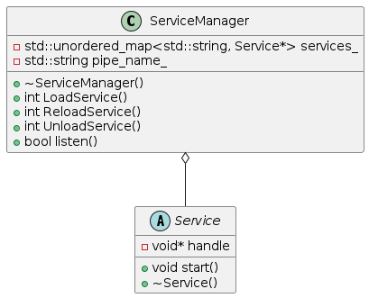

# LDM
a simple dynamic library manager.
# Usage
1. implement `Service` interface and export `get_service()` function.
2. listen service with `ServiceManager` in your main function.

# Command
```shell
# load xxx service
xxx load xxx
# reload xxx service
xxx reload xxx
# unload xxx service
xxx unload xxx
```
# Architecture
